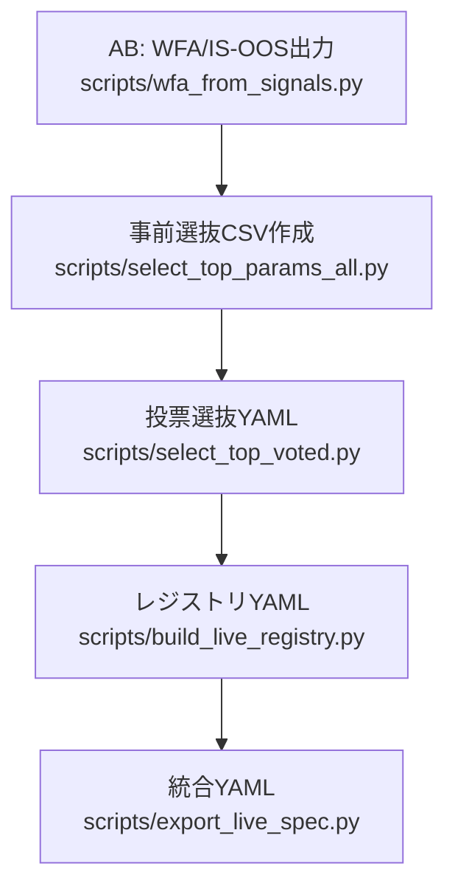

以下に「工程ごとの入力→処理→出力」を、関係ファイル/中間CSVも含めてフロー中心に徹底解説します。参照パスはすべて実ファイルです。

# 全体フロー（結果物のつながり）

# A: WFA実行（IS/OOSの基礎データをつくる）
実行コマンド（AB）
- `uv run python scripts/wfa_from_signals.py --config configs/strategy/scout_london_open_eurusd_m15_refine.yaml --debug`
- `uv run python scripts/wfa_from_signals.py --config configs/strategy/scout_ny_overlap_eurusd_m15_refine.yaml --debug`

入力
- __[戦略設定]__  
  - [configs/strategy/scout_london_open_eurusd_m15_refine.yaml](cci:7://file:///c:/Users/yushi/work/trade_app/configs/strategy/scout_london_open_eurusd_m15_refine.yaml:0:0-0:0)
  - [configs/strategy/scout_ny_overlap_eurusd_m15_refine.yaml](cci:7://file:///c:/Users/yushi/work/trade_app/configs/strategy/scout_ny_overlap_eurusd_m15_refine.yaml:0:0-0:0) ← @[configs/strategy/scout_ny_overlap_eurusd_m15_refine.yaml](cci:7://file:///c:/Users/yushi/work/trade_app/configs/strategy/scout_ny_overlap_eurusd_m15_refine.yaml:0:0-0:0)
- これらは指標（例: `rsi`, `bb`）やストップ（`stops.mode: atr_rr`）などの探索範囲を定義

処理
- 指定期間でIS/OOS分割し、各パラメータ列（列=異なる戦略構成）でバックテスト
- vbtproでIS/OOS統計や列別統計を生成

出力（中間CSV）
- ロンドン: `runs/scout_london_open_eurusd_m15/{is.csv,oos.csv,is_per.csv,oos_per.csv}`
- NY重なり: `runs/scout_ny_overlap_eurusd_m15/{is.csv,oos.csv,is_per.csv,oos_per.csv}`
- リファイン: 同様に `..._refine/` 配下も生成（今回両方実施済）
- 列マッピング: `runs/wfa_columns_mapping.csv`（列IDと構成の対応）

これらのCSVは「どの列（=どの構成）」が良いかを次段で評価・選抜するための素材です。

# B: 事前選抜（列別OOSの足切り）
実行コマンド（ABの3本目）
- `uv run python scripts/select_top_params_all.py --pf-min 1.2 --dd-max 8 --win-min 45 --top 30`

入力
- __[列別OOS統計]__  
  - `runs/*/oos_per.csv`（4ディレクトリ分: london/ny と各_refine）

処理
- OOSの列ごと統計からフィルタ:
  - PF >= 1.2
  - MaxDD <= 8%
  - Win% >= 45%
- 上位30行/ディレクトリを保存
- さらに全体を結合

出力（中間CSV）
- `runs/scout_london_open_eurusd_m15/top_params_oos.csv`
- `runs/scout_london_open_eurusd_m15_refine/top_params_oos.csv`
- `runs/scout_ny_overlap_eurusd_m15/top_params_oos.csv`
- `runs/scout_ny_overlap_eurusd_m15_refine/top_params_oos.csv`
- 結合: [runs/summary/combined_top_params.csv](cci:7://file:///c:/Users/yushi/work/trade_app/runs/summary/combined_top_params.csv:0:0-0:0)

備考
- PF=inf は `select` 段階で 10 にクリップ（後述C1）。この工程では oos_per.csv 由来の実数として扱われます。

# C1: 投票選抜（複数ディレクトリの上位を集計→ID採択）
実行コマンド
- `uv run python scripts/select_top_voted.py --defaults configs/ensemble/select/select_defaults_eurusd_m15.yaml --out runs/summary/selected_ids_eurusd_m15.yaml`

入力
- __[事前結合]__ [runs/summary/combined_top_params.csv](cci:7://file:///c:/Users/yushi/work/trade_app/runs/summary/combined_top_params.csv:0:0-0:0)
- __[選抜ルール]__ [configs/ensemble/select/select_defaults_eurusd_m15.yaml](cci:7://file:///c:/Users/yushi/work/trade_app/configs/ensemble/select/select_defaults_eurusd_m15.yaml:0:0-0:0) ← @[configs/ensemble/select/select_defaults_eurusd_m15.yaml](cci:7://file:///c:/Users/yushi/work/trade_app/configs/ensemble/select/select_defaults_eurusd_m15.yaml:0:0-0:0)
  - PF=infの扱い: `normalize.profit_factor_inf.mode: clip` / `clip_to: 10.0`
  - スコア重みや標準化ルール

処理
- 列IDごとにスコアリング・投票集計
- PF=inf は 10 として正規化 → スコアに反映
- 最終的に閾値を超えたIDを採択

出力
- __[採択ID一覧]__ `runs/summary/selected_ids_eurusd_m15.yaml` ← @`runs/summary/selected_ids_eurusd_m15.yaml`  
  例（今回の実績）:
  - `thr=|rsi=14|bb=(30, 2.0)` points=3.0 score=0.6 trades=8 PF=10.0 win=100% maxdd=0.2115%
  - `thr=|rsi=14|bb=(30, 1.75)` points=3.0 score=0.2 trades=8 PF=10.0 win=100% maxdd=0.2115%

# C2: レジストリ生成（実行可能な列の定義を確定）
実行コマンド
- `uv run python scripts/build_live_registry.py --selected runs/summary/selected_ids_eurusd_m15.yaml --out runs/summary/live_registry_eurusd_m15.yaml`

入力
- __[採択ID一覧]__ `runs/summary/selected_ids_eurusd_m15.yaml`

処理
- 列IDを具体パラメータに展開（`rsi=14`, `bb=(30, 2.0)` など）
- 由来ロール（`roll: scout_ny_overlap` など）を明記

出力
- __[レジストリ]__ `runs/summary/live_registry_eurusd_m15.yaml` ← @`runs/summary/live_registry_eurusd_m15.yaml`  
  例:
  - id: `thr=|rsi=14|bb=(30, 1.75)` → `rsi:14`, `bb:(30,1.75)`, `roll: scout_ny_overlap` …
  - id: `thr=|rsi=14|bb=(30, 2.0)` → `rsi:14`, `bb:(30,2.0)`, `roll: scout_ny_overlap` …

# E: 統合YAML（外部アプリ/実運用向け仕様の最終形）
実行コマンド
- `uv run python scripts/export_live_spec.py --registry runs/summary/live_registry_eurusd_m15.yaml --symbol EURUSD --timeframe M15 --base configs/strategy/_london_open_rr.pro.fast.yaml --vbt-params configs/ensemble/eurusd_m15/vbt_params.yaml --out runs/summary/live_spec_eurusd_m15.yaml`

入力
- __[レジストリ]__ `runs/summary/live_registry_eurusd_m15.yaml`
- __[ベース戦略]__ [configs/strategy/_london_open_rr.pro.fast.yaml](cci:7://file:///c:/Users/yushi/work/trade_app/configs/strategy/_london_open_rr.pro.fast.yaml:0:0-0:0) ← @[configs/strategy/_london_open_rr.pro.fast.yaml](cci:7://file:///c:/Users/yushi/work/trade_app/configs/strategy/_london_open_rr.pro.fast.yaml:0:0-0:0)  
  - 例: `stops.mode: atr_rr`, `atr_window/k_for_sl/rr` の候補
- __[vbtパラメータ]__ [configs/ensemble/eurusd_m15/vbt_params.yaml](cci:7://file:///c:/Users/yushi/work/trade_app/configs/ensemble/eurusd_m15/vbt_params.yaml:0:0-0:0) ← @[configs/ensemble/eurusd_m15/vbt_params.yaml](cci:7://file:///c:/Users/yushi/work/trade_app/configs/ensemble/eurusd_m15/vbt_params.yaml:0:0-0:0)  
  - 例: `order_type: market`, `price: nextopen`, `slippage_rate`, `fees_rate`, `size`, `leverage`, `init_cash`

処理
- レジストリの列をアンサンブル`columns`に採用し、等重み`weights`を設定
- ベース戦略の `stops` と vbt実行系の `execution` を統合
