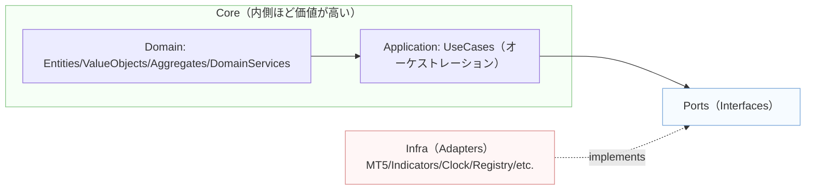

# DDDルール（PoC〜本番まで共通）

## 0) 依存方向・レイヤ（守るべき大原則）

* **依存は内向きのみ**（Domain ← UseCase ← Ports(抽象) ← Infra(実装)）。内側は外側の存在を知らない・命名も参照しない。これが**Dependency Rule**。([blog.cleancoder.com][3])
* **通信点はPort（interface）だけ**。`UseCase`は`Port`経由で外界と会話、`Infra`は`Port`を実装（Adapter）。複数Adapter（MT5/Mock/将来の別ブローカー）を**差し替え自由**にする。([alistair.cockburn.us][1], [AWS ドキュメント][2])

---

## 1) モデリング（戦術DDD）

* **Aggregateは不変条件の境界**。外部は**Aggregate Root**経由でのみ操作し、Rootが不変条件を守る。Root外しの直接操作は禁止。([Microsoft Learn][5])
* **Entity**は識別子を持つ。**Value Object**は等価性で扱い、**不変**に寄せる（例：`RiskPct(0.02)`）。([Microsoft Learn][6])
* **Domain Service**は複数エンティティ横断の純粋計算（例：ATR×RRのSL/TP算出、2%リスクのロット計算）。副作用を持たない。
* **Ubiquitous Language**で命名（YAMLの語彙と一致させる）。Bounded Context（本プロダクトは“ライブ運用”の文脈）を越える語彙混乱を避ける。([Microsoft Learn][7], [ウィキペディア][8])

## 2) アプリケーション層（UseCase）

* **手続きはUseCaseへ集約**。ドメイン規則（計算）はDomainへ、入出力はPortsへ委譲。
* UseCaseは**トランザクション境界**・**順序**・**再試行**・**監査ログ**などの**アプリ制御**に専念。
* UseCaseからInfra具体型は**見えない**（DIで`Port`注入）。

## 3) Ports & Adapters（Hexagonalの実装）

* **Portは最小の会話語彙**：`BrokerPort.send_order(req)` のようにユースケースに必要な**言葉**だけを定義。アダプタ固有の型（MT5の列挙や構造体）を**漏らさない**。([alistair.cockburn.us][1])
* **Adapterは翻訳機**：外部SDKの語彙（MT5の`deviation`=ポイントなど）を**Portの語彙**へ変換して吸収。**SDKの罠はAdapter内で完結**させる。
* **複数YAML対応**は `RegistryPort` が束ねる（いまの設計どおり）。Runner/UseCaseは**spec\_idでループ**するだけで拡張可能。

## 4) ドメインイベント（任意だが強力）

* **Domain Event**で“起きた事実”を記録・伝播（例：`OrderPlaced`, `StopUpdated`）。集約内の状態変化をイベント化し、後続処理や監査に活用。([martinfowler.com][9], [Microsoft Learn][10])
* 将来**イベント駆動/ES**を検討する際もスムーズ（状態はイベントから再構築できる）。([martinfowler.com][11])

## 5) 永続化・外部I/O（今回はブローカーI/Oが主）

* DDDでは**Repository**を用いて集約を保存/再構築するが、今回PoCは主に**ブローカーI/O**。必要になったら`RepositoryPort`を追加し**Domainから分離**。([Microsoft Learn][12], [Software Engineering Stack Exchange][13])

## 6) コード規約・構成規約（このプロジェクト固有の運用）

* **ファイルは400行以内**：役割単位に分割。循環依存NG。
* **ディレクトリ固定**：`app/ usecase/ domain/ ports/ infrastructure/ constants/ configs/ tests/` は**不変**。増やすのは**AdapterやService**のみ。
* **命名**：

  * Portは `SomethingPort`、Adapterは `Something<Provider>Adapter`。
  * UseCaseは `verb_noun_uc.py`、Serviceは動詞+名詞。
  * Domainの型は**ユビキタス言語**に合わせる。
* **例外/再試行**：UseCaseは**期待可能な失敗**（接続・一時エラー）に`retry/backoff`。ドメイン規則違反は**即失敗**。
* **設定**：`pydantic-settings` で型安全にロード、`extra='forbid'`。
* **テスト**：

  * Domainは**純粋テスト**（副作用ゼロ）。
  * UseCaseは**Portのフェイク**でユースケース網羅。
  * Infraは**統合テスト**（環境依存）。
* **CI**：lint/format、**pre-commitで400行超検査**を推奨（将来hook追加）。

---

# 運用ルール（MT5/シグナルに関する現実対策）

* **SDK依存の罠はAdapterで完結**：`deviation`は\*\*“ポイント”**単位、`type_filling`は口座仕様に合わせる——これは**BrokerAdapter内部\*\*で解決し、上位に漏らさない。([Microsoft Learn][4])
* **次足始値の厳密化**：新バー検知→open取得の同期を**MarketDataAdapterで担保**。UseCaseは「次足始値で発注」という**意図のみ**を記述。
* **複数YAML**：`RegistryPort.list_specs()` の列挙結果をそのまま回すだけ。UseCase/Runnerは**一切の仕様差（通貨・時間帯）を知らない**。

---

# よくある設計の迷い → 推奨判断

1. **“UseCaseが外部SDK型を触ってもいい？”** → **ダメ**。**Portの語彙**に閉じる（SDK変更時に波及しないため）。([blog.cleancoder.com][3])
2. **“Aggregateって今すぐ要る？”** → **最小でOK**。PoCでは計算中心でも、将来状態を強く持つなら導入（Root経由操作を厳守）。([Microsoft Learn][5])
3. **“イベント導入のタイミング？”** → **監査や非同期連携が必要になったら**。今は`FileStore`ログで足りれば十分。([martinfowler.com][9])

---

# ルール早見表（チェックリスト）

* \[依存方向] 内向きのみ。Domainは外界を**知らない**。([blog.cleancoder.com][3])
* \[語彙] Portはユースケースの**会話語彙だけ**定義。SDKの型・単位変換はAdapterで。([alistair.cockburn.us][1])
* \[Aggregate] 不変条件はRootが守る。Root以外へ直アクセス禁止。([Microsoft Learn][5])
* \[ValueObject] 等価性・不変に寄せる。([Microsoft Learn][6])
* \[UseCase] 手続き・リトライ・順序制御。ビジネス計算はDomainへ。
* \[イベント] “起きた事実”を記録・伝播（必要に応じて）。([martinfowler.com][9])
* \[構成] ディレクトリは固定。1ファイル≤400行。循環依存NG。
* \[テスト] Domainは純粋、UseCaseはフェイクPort、Infraは統合。
* \[設定] 型安全ロード、余計な設定は弾く。
* \[拡張] 新ブローカー/新指標/新YAML＝**Adapter or Registry**を追加。既存レイヤは**無変更**が原則。

## まとめ

* \*\*現構成は疎結合（Ports & Adapters / Clean Architecture）\*\*で、DDDの原則に適合しています。
* 上の**DDDルール**をチェックリストとして採用すれば、**複数YAML・複数ブローカー・将来のイベント駆動**にも“変化に強い”拡張ができます。
