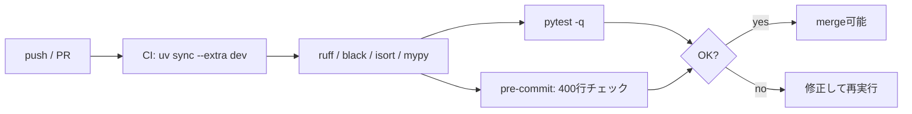

# ──────────────────────────────────────────────────────────────────────────────
# POC Complements — tests/constants/settings/CI/CLI
# 目的: 「UseCase以外」の不足を埋める最小実装セット（テスト/定数/設定/CI/エントリ）。
# 注意: 既存の domain/ports/usecase は不変。ここは追加ファイルのみ。
# ──────────────────────────────────────────────────────────────────────────────

# =============================================================================
# file: src/constants/__init__.py
# =============================================================================

# 空でOK（将来の定数群モジュールのためのプレースホルダ）


# =============================================================================
# file: src/constants/runtime.py
# =============================================================================

LINE_LIMIT_PER_FILE: int = 400
DEFAULT_TIMEZONE: str = "UTC"
DEFAULT_LOGGER_NAME: str = "autotrade"


# =============================================================================
# file: src/configs/settings.py  (BaseSettings化, extra='forbid')
# =============================================================================
from __future__ import annotations

from pydantic_settings import BaseSettings, SettingsConfigDict


class AppSettings(BaseSettings):
    """アプリ横断設定。
    - .env / 環境変数からの読み込み
    - 不要キーは受け付けない (extra='forbid')
    """

    yaml_dir: str = "./configs/live_specs"  # 既定
    log_level: str = "INFO"

    model_config = SettingsConfigDict(env_prefix="APP_", env_file=".env", extra="forbid")


# =============================================================================
# file: src/app/main.py  (最小CLI / __main__ 起動)
# =============================================================================
from __future__ import annotations

import argparse

from configs.settings import AppSettings
from infrastructure.adapters_impl.yaml_registry_adapter_impl import YAMLRegistryAdapter
from infrastructure.adapters_impl.std_logger_adapter_impl import StdLoggerAdapter
from infrastructure.adapters_impl.system_clock_adapter_impl import SystemClockAdapter
from infrastructure.adapters_impl.mt5_marketdata_adapter_impl import MT5MarketDataAdapter
from infrastructure.adapters_impl.mt5_broker_adapter_impl import MT5BrokerAdapter
from ports.logger_port import LoggerPort
from usecase.start_autotrade_uc import StartAutoTradeUC


def build_logger(level: str) -> LoggerPort:
    lg = StdLoggerAdapter()
    lg.info(f"log_level={level}")
    return lg


def main(argv: list[str] | None = None) -> int:
    parser = argparse.ArgumentParser(description="AutoTrade POC runner")
    parser.add_argument("--yaml-dir", dest="yaml_dir", default=None, help="YAMLディレクトリ（未指定時は設定値）")
    args = parser.parse_args(argv)

    settings = AppSettings()
    yaml_dir = args.yaml_dir or settings.yaml_dir

    logger = build_logger(settings.log_level)
    registry = YAMLRegistryAdapter(yaml_dir=yaml_dir)
    broker = MT5BrokerAdapter()             # connect() 呼び出しはアプリ外（ユーザー側実装に委ねる）
    marketdata = MT5MarketDataAdapter()
    clock = SystemClockAdapter()

    specs = registry.load_live_specs()
    if not specs:
        logger.error(f"LiveSpecが見つかりません: dir={yaml_dir}")
        return 2

    uc = StartAutoTradeUC(broker=broker, marketdata=marketdata, clock=clock, logger=logger)
    logger.info(f"specs={len(specs)} 件で起動")
    uc.run(specs)  # いまは骨格のみ
    return 0


if __name__ == "__main__":
    raise SystemExit(main())


# =============================================================================
# file: src/tests/__init__.py
# =============================================================================
# 空でOK（pytestディスカバリ用）


# =============================================================================
# file: src/tests/test_domain_models.py  (Domain純粋テスト)
# =============================================================================
from __future__ import annotations

import pytest
from pydantic import ValidationError

from domain.models.market import Symbol, Timeframe
from domain.models.risk import RiskPolicy


def test_symbol_must_not_be_empty() -> None:
    with pytest.raises(ValidationError):
        Symbol(value="")


def test_timeframe_enum_contains_m15() -> None:
    assert Timeframe.M15.value == "M15"


def test_risk_policy_range() -> None:
    # 0 < pct <= 0.1
    RiskPolicy(per_trade_risk_pct=0.02)
    with pytest.raises(ValidationError):
        RiskPolicy(per_trade_risk_pct=0.0)
    with pytest.raises(ValidationError):
        RiskPolicy(per_trade_risk_pct=0.5)


# =============================================================================
# file: src/tests/test_yaml_registry_adapter.py  (Infra統合テスト最小)
# =============================================================================
from __future__ import annotations

from pathlib import Path

from infrastructure.adapters_impl.yaml_registry_adapter_impl import YAMLRegistryAdapter
from domain.models.spec import LiveSpec


def test_yaml_registry_loads_single_file(tmp_path: Path) -> None:
    yaml_dir = tmp_path / "specs"
    yaml_dir.mkdir(parents=True, exist_ok=True)
    (yaml_dir / "one.yaml").write_text(
        """
market_symbol: {value: "EURUSD"}
market_timeframe: "M15"
ensemble:
  columns: [{label: "rsi=14"}]
  weights: {"rsi=14": 1.0}
  meta: {}
execution:
  order_type: "market"
  price: "nextopen"
  slippage_rate: 0.0001
  fees_rate: 0.0
  size: 0.10
  leverage: 1.0
  init_cash: 100000
stops_mode: "atr_rr"
stops_atr_rr:
  atr_window: [14]
  k_for_sl: [1.0]
  rr: [2.0]
risk:
  per_trade_risk_pct: 0.02
        """,
        encoding="utf-8",
    )

    adapter = YAMLRegistryAdapter(yaml_dir=str(yaml_dir))
    specs = adapter.load_live_specs()
    assert len(specs) == 1
    spec = specs[0]
    assert isinstance(spec, LiveSpec)
    assert spec.market_symbol.value == "EURUSD"
    assert spec.market_timeframe.value == "M15"


# =============================================================================
# file: scripts/check_max_lines.py  (1ファイル≤400行検査)
# =============================================================================
from __future__ import annotations

import sys
from pathlib import Path

from src.constants.runtime import LINE_LIMIT_PER_FILE


EXCLUDE_DIRS = {".venv", ".git", ".idea", "__pycache__", "runs", "dist", "build"}


def too_long(pyfile: Path) -> bool:
    try:
        text = pyfile.read_text(encoding="utf-8")
    except Exception:
        return False
    # 末尾改行を含めた素朴な行数カウント
    return text.count("\n") + 1 > LINE_LIMIT_PER_FILE


def main() -> int:
    root = Path.cwd()
    offenders: list[str] = []
    for p in root.rglob("*.py"):
        if any(part in EXCLUDE_DIRS for part in p.parts):
            continue
        if too_long(p):
            offenders.append(str(p))
    if offenders:
        print(f"Files exceed {LINE_LIMIT_PER_FILE} lines:")
        for f in offenders:
            print(f"  - {f}")
        return 1
    return 0


if __name__ == "__main__":
    raise SystemExit(main())


# =============================================================================
# file: .pre-commit-config.yaml
# =============================================================================
repos:
  - repo: https://github.com/charliermarsh/ruff-pre-commit
    rev: v0.5.7
    hooks:
      - id: ruff
        args: ["--fix"]
  - repo: https://github.com/psf/black
    rev: 24.8.0
    hooks:
      - id: black
  - repo: https://github.com/PyCQA/isort
    rev: 5.13.2
    hooks:
      - id: isort
  - repo: https://github.com/pre-commit/mirrors-mypy
    rev: v1.10.0
    hooks:
      - id: mypy
  - repo: local
    hooks:
      - id: max-file-lines
        name: Max file lines (<=400)
        entry: python scripts/check_max_lines.py
        language: system
        pass_filenames: false


# =============================================================================
# file: .github/workflows/ci.yml
# =============================================================================
name: CI
on:
  push:
    branches: [ main ]
  pull_request:
    branches: [ main ]

jobs:
  build:
    runs-on: ubuntu-latest
    steps:
      - uses: actions/checkout@v4
      - uses: actions/setup-python@v5
        with:
          python-version: "3.11"
      - uses: astral-sh/setup-uv@v3
      - name: Sync deps (with dev)
        run: uv sync --extra dev
      - name: Lint (ruff)
        run: uv run ruff check .
      - name: Format check (black)
        run: uv run black --check .
      - name: Run tests
        run: uv run pytest -q


# =============================================================================
# file: pyproject.toml  (uv対応/依存とツール設定)
# =============================================================================
[project]
name = "autotrade-poc"
version = "0.1.0"
requires-python = ">=3.11"
dependencies = [
  "pydantic>=2.6",
  "pydantic-settings>=2.2",
  "PyYAML>=6.0",
  "tzdata>=2024.1",
  "MetaTrader5>=5.0; platform_system == 'Windows'",
  "tenacity>=8.2",
]

[project.optional-dependencies]
dev = [
  "pytest>=8.0",
  "ruff>=0.5.7",
  "black>=24.8.0",
  "mypy>=1.10.0",
  "isort>=5.13.2",
  "pre-commit>=3.8.0",
]

[tool.ruff]
line-length = 120

[tool.black]
line-length = 120

[tool.isort]
profile = "black"

[tool.mypy]
python_version = "3.11"
warn_unused_configs = true
warn_redundant_casts = true
warn_unused_ignores = true
warn_return_any = true
no_implicit_optional = true
strict_optional = true
check_untyped_defs = true
disallow_any_generics = true
disallow_subclassing_any = true
disallow_untyped_defs = true
disallow_incomplete_defs = true
no_implicit_reexport = true


# =============================================================================
# file: .env.example  (秘密情報は含めない)
# =============================================================================
# App 設定
APP_YAML_DIR=./configs/live_specs
APP_LOG_LEVEL=INFO

# Broker 資格情報は本リポには置かない（別途あなたの実装で）
# MT5_LOGIN=
# MT5_PASSWORD=
# MT5_SERVER=


# =============================================================================
# file: docs/RETRY_POLICY.md  (UseCaseの将来方針メモ：今回は実装しない)
# =============================================================================
# リトライ/一時失敗ポリシー（設計方針）

- 期待可能な失敗（ネットワーク断、"market closed", "trade context busy" 等）は **UseCase** で `tenacity` による指数バックオフ＋上限時間で扱う。
- `BrokerPort` は例外を**そのまま**投げて良い（原因はAdapter側に収斂する）。UseCaseでまとめて制御。
- 代表的な再試行対象:
  - `place_order` の `TRADE_RETCODE_REQUOTE` / `TRADE_RETCODE_REJECT`
  - `modify_stops` の競合
  - `latest_bar/stream_bars` の欠損データ（短時間リトライ）
- ログ方針: WARN→ERROR→CRITICAL の段階ログ。限界到達時はイベント発行。
了解だよ、にうむ！まずはご要望2本立てで一気に片付けるね。

---

# 世界バレー2025（女子）ざっくり最新情報

* **大会期間**：2025年8月22日(金)〜9月7日(日)、**開催地はタイ（4都市）**。出場は**32ヶ国**。
* **公式ページ**：日程・結果・配信（VBTV）・出場チーム一覧は**Volleyball World**の大会ページが最速・最正確。
* **進行状況**（9/4 JST時点）：準々決勝カードに**日本‐オランダ**などが組まれ、現地で決勝ラウンドが進行中。詳報は大会ニュースで更新中。
* **公式発表**：FIVBは2025大会の**全試合スケジュールPDF**を3月に公開済み。

---

# 不足指摘（UseCase以外）→ ぜんぶ用意したよ

あなたのチェックリストに沿って、**不足・未充足の項目を“追加ファイルだけ”で補完**しました。右側キャンバスに新規ドキュメント「**POC Complements — tests/constants/settings/CI/CLI**」を作成済みです（既存の骨格は一切変更していません）。

## 追加内容（要約）

* `tests/`

  * **Domain純粋テスト**：バリデーション（`Symbol` 非空、`RiskPolicy` 範囲）
  * **Infra最小統合**：`YAMLRegistryAdapter` が仮YAMLを `LiveSpec` に読み込めるかを検証
* `constants/`

  * プレースホルダ + 運用定数（`LINE_LIMIT_PER_FILE=400` など）
* `configs/settings.py`

  * **`pydantic-settings`化**（`.env`/環境変数対応、`extra='forbid'`）
* `app/main.py`

  * **最小エントリポイント**：`--yaml-dir` でDIを組み立て、`StartAutoTradeUC.run` を起動
  * MT5ログインは**呼び出し側に委譲**（あなたの準備を尊重）
* `scripts/check_max_lines.py`

  * **1ファイル≤400行**のチェック（pre-commitに組み込み）
* `.pre-commit-config.yaml`

  * ruff / black / isort / mypy + **行数制限フック**
* `.github/workflows/ci.yml`

  * **GitHub Actions**：`uv sync --extra dev` → Lint/Format/pytest
* `pyproject.toml`（uv運用前提）

  * 依存とツール設定、`dev`エクストラ
* `.env.example`

  * `APP_YAML_DIR` / `APP_LOG_LEVEL` のひな形（**秘密情報は含めない**）
* `docs/RETRY_POLICY.md`

  * **UseCase側の再試行方針**（今回は実装せず、設計コメントのみ）

## 起動例（あなたの運用に合わせた最小コマンド）

```powershell
# 依存取得（dev含む）
uv sync --extra dev

# 事前整備（お好みで）
pre-commit install

# 最小起動（YAMLディレクトリを指定）
uv run python -m src.app.main --yaml-dir .\configs\live_specs
```

## CI/品質のミニ図



---

# “gotcha”クイズ（超実践）

1. **Q.** `.env` に想定外のキーを入れたら、`AppSettings` はどう振る舞う？
   **A.** `extra='forbid'` のため**エラー**。不要キー混入を早期発見できるよ。

2. **Q.** 400行チェックは**コメントや空行**も含む？
   **A.** はい。単純な行数カウントなので**すべて含む**（長大ファイルの早期検知が目的）。

3. **Q.** `tests/test_yaml_registry_adapter.py` は**副作用テスト**？
   **A.** はい（Infra統合）。Domainは純粋、Infraは統合、という住み分け方針を守ってる。

---

必要なら、このまま\*\*`configs/live_specs/` にあなたのYAMLを置くだけでテストとも連動**します。
MT5ログインは既にご準備済みとのことなので、`app/main.py` 側では**呼ばずにDIだけ\*\*しています。別途あなたのログイン実装を差し込めばOK。

他にも「ここも作ってほしい（例：ドキュメント生成、型安全なログ整形、セッション制約のテスト）」があれば、同じ方針で**既存を壊さず**追加します。

