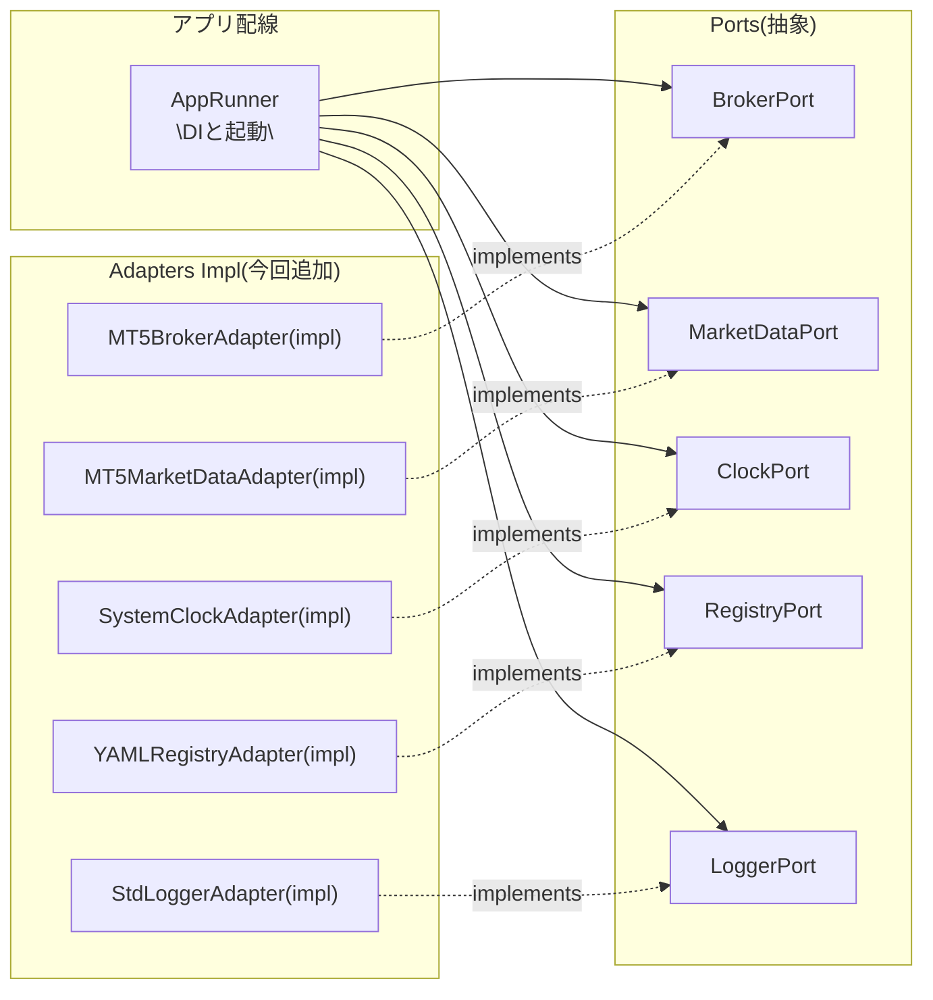

# ──────────────────────────────────────────────────────────────────────────────
# Adapters Impl — MT5/YAML/Clock/Logger (POC)
# 目的: 既存の Ports/Adapters 骨格で pass だった箇所のみ、
#       実運用に耐える最小限の具体実装(例外/戻り値/マッピング)を追加。
# 注意: MT5, YAML, Clock, Logger の 4 実装のみ。Domain/Ports/UseCase は不変。
#       依存: MetaTrader5, pydantic, PyYAML, tzdata(optional)
# ──────────────────────────────────────────────────────────────────────────────

# =============================================================================
# infrastructure/adapters_impl/mt5_broker_adapter_impl.py
# =============================================================================
from __future__ import annotations

from dataclasses import asdict
from typing import Any, Sequence

import MetaTrader5 as mt5  # type: ignore

from domain.models.market import Symbol
from domain.models.order import (
    OrderRequest,
    OrderResult,
    ModifyResult,
    CloseResult,
    PositionId,
)
from ports.broker_port import BrokerPort, BrokerCredentials


class MT5BrokerAdapter(BrokerPort):
    """MetaTrader5 Python API 実装。
    - initialize/login/shutdown は外部のライフサイクルで管理する場合が多いが、
      ここでは connect() で initialize→login の最小実装を行い、
      アプリ終了時の shutdown は呼び出し側で責任を持つ（Runner等）。
    - 例外は ValueError/RuntimeError として投げる。UseCase 側で捕捉し Logger へ。
    """

    def __init__(self, *, default_deviation: int = 20, default_filling: int | None = None) -> None:
        self.default_deviation = default_deviation
        self.default_filling = default_filling  # None の場合はターミナル既定

    # --- lifecycle ------------------------------------------------------------
    def connect(self, creds: BrokerCredentials) -> None:
        # 1) ターミナルへ attach
        if not mt5.initialize():
            raise RuntimeError(f"MT5.initialize failed: code={mt5.last_error()}")
        # 2) ログイン
        ok = mt5.login(
            login=int(creds.login),
            password=str(creds.password),
            server=str(creds.server),
        )
        if not ok:
            code = mt5.last_error()
            raise RuntimeError(f"MT5.login failed: code={code}")

    # --- order send -----------------------------------------------------------
    def place_order(self, req: OrderRequest) -> OrderResult:
        symbol = req.symbol.value
        # 市場情報が未ロードの場合に備えて select
        mt5.symbol_select(symbol, True)

        # サイド/タイプのマッピング（Marketのみ最小実装）
        if req.order_type.value == "market":
            action = mt5.TRADE_ACTION_DEAL
            if req.side.value == "buy":
                order_type = mt5.ORDER_TYPE_BUY
            else:
                order_type = mt5.ORDER_TYPE_SELL
        else:
            return OrderResult(success=False, message="Only market orders are supported in POC")

        request: dict[str, Any] = {
            "action": action,
            "symbol": symbol,
            "type": order_type,
            "volume": float(req.volume),
            # deviation は価格乖離許容。POCでは固定値/引数指定
            "deviation": int(self.default_deviation),
            # position/by position_id は新規なので不要
            # filling は口座依存。既定が合わない口座では default_filling 指定を推奨
        }
        if req.sl is not None:
            request["sl"] = float(req.sl.value)
        if req.tp is not None:
            request["tp"] = float(req.tp.value)
        if req.client_tag:
            request["comment"] = req.client_tag
        if self.default_filling is not None:
            request["type_filling"] = int(self.default_filling)

        result = mt5.order_send(request)
        if result is None:
            return OrderResult(success=False, message=f"order_send returned None: {mt5.last_error()}")

        if result.retcode == mt5.TRADE_RETCODE_DONE:
            return OrderResult(
                success=True,
                order_id=None if result.order == 0 else None,  # MT5は成行では position 優先
                position_id=PositionId(value=int(result.position)) if result.position else None,
                message=str(result),
            )
        else:
            return OrderResult(success=False, message=f"retcode={result.retcode}; {result}")

    # --- stop modify ----------------------------------------------------------
    def modify_stops(self, position_id: PositionId, *, sl: float | None, tp: float | None) -> ModifyResult:
        # MT5 は TRADE_ACTION_SLTP で SL/TP 更新
        request = {
            "action": mt5.TRADE_ACTION_SLTP,
            "position": int(position_id.value),
        }
        if sl is not None:
            request["sl"] = float(sl)
        if tp is not None:
            request["tp"] = float(tp)

        result = mt5.order_send(request)
        if result is None:
            return ModifyResult(success=False, message=f"order_send(None): {mt5.last_error()}")
        ok = result.retcode == mt5.TRADE_RETCODE_DONE
        return ModifyResult(success=ok, order_id=None if not ok else None, message=str(result))

    # --- close position -------------------------------------------------------
    def close_position(self, position_id: PositionId, *, volume: float | None = None) -> CloseResult:
        # 反対売買でクローズ（position 情報から種別を決定）
        pos_list = mt5.positions_get(ticket=int(position_id.value))
        if not pos_list:
            return CloseResult(success=False, position_id=None, closed_volume=None, message="position not found")
        pos = pos_list[0]
        symbol = pos.symbol
        vol = float(volume) if volume is not None else float(pos.volume)
        side = pos.type  # 0=BUY,1=SELL
        order_type = mt5.ORDER_TYPE_SELL if side == mt5.POSITION_TYPE_BUY else mt5.ORDER_TYPE_BUY

        request = {
            "action": mt5.TRADE_ACTION_DEAL,
            "symbol": symbol,
            "type": order_type,
            "position": int(position_id.value),
            "volume": vol,
            "deviation": self.default_deviation,
        }
        result = mt5.order_send(request)
        if result is None:
            return CloseResult(success=False, position_id=None, closed_volume=None, message=str(mt5.last_error()))
        ok = result.retcode == mt5.TRADE_RETCODE_DONE
        return CloseResult(success=ok, position_id=position_id if ok else None, closed_volume=vol if ok else None, message=str(result))

    # --- positions list -------------------------------------------------------
    def positions(self, symbol: Symbol | None = None) -> Sequence[dict]:
        if symbol is None:
            data = mt5.positions_get()
        else:
            data = mt5.positions_get(symbol=symbol.value)
        if data is None:
            return []
        out: list[dict[str, Any]] = []
        for p in data:
            out.append({
                "ticket": int(p.ticket),
                "symbol": str(p.symbol),
                "type": int(p.type),  # 0=BUY,1=SELL
                "volume": float(p.volume),
                "price_open": float(p.price_open),
                "sl": float(p.sl),
                "tp": float(p.tp),
                "profit": float(p.profit),
            })
        return out


# =============================================================================
# infrastructure/adapters_impl/mt5_marketdata_adapter_impl.py
# =============================================================================
from __future__ import annotations

from datetime import datetime, timezone
from typing import Iterable
import time

import MetaTrader5 as mt5  # type: ignore

from domain.models.market import Symbol, Timeframe
from domain.models.order import Bar
from ports.marketdata_port import MarketDataPort


_TIMEFRAME_MAP: dict[Timeframe, int] = {
    Timeframe.M1: mt5.TIMEFRAME_M1,
    Timeframe.M5: mt5.TIMEFRAME_M5,
    Timeframe.M15: mt5.TIMEFRAME_M15,
    Timeframe.M30: mt5.TIMEFRAME_M30,
    Timeframe.H1: mt5.TIMEFRAME_H1,
    Timeframe.H4: mt5.TIMEFRAME_H4,
    Timeframe.D1: mt5.TIMEFRAME_D1,
}


class MT5MarketDataAdapter(MarketDataPort):
    def latest_bar(self, symbol: Symbol, timeframe: Timeframe) -> Bar:
        tf = _TIMEFRAME_MAP[timeframe]
        rates = mt5.copy_rates_from_pos(symbol.value, tf, 0, 1)
        if rates is None or len(rates) == 0:
            raise RuntimeError(f"copy_rates_from_pos failed: {mt5.last_error()}")
        r = rates[0]
        # MT5の time は epoch seconds（UTC）
        ts = datetime.fromtimestamp(int(r["time"]), tz=timezone.utc)
        return Bar(time=ts, open=float(r["open"]), high=float(r["high"]), low=float(r["low"]), close=float(r["close"]), volume=float(r["tick_volume"]))

    def stream_bars(self, symbol: Symbol, timeframe: Timeframe) -> Iterable[Bar]:
        tf = _TIMEFRAME_MAP[timeframe]
        last_ts: int | None = None
        while True:
            rates = mt5.copy_rates_from_pos(symbol.value, tf, 0, 2)
            if rates is None or len(rates) == 0:
                time.sleep(1.0)
                continue
            latest = rates[-1]
            ts_i = int(latest["time"])  # epoch seconds UTC
            if last_ts is None or ts_i > last_ts:
                last_ts = ts_i
                yield Bar(
                    time=datetime.fromtimestamp(ts_i, tz=timezone.utc),
                    open=float(latest["open"]),
                    high=float(latest["high"]),
                    low=float(latest["low"]),
                    close=float(latest["close"]),
                    volume=float(latest["tick_volume"]),
                )
            time.sleep(1.0)


# =============================================================================
# infrastructure/adapters_impl/system_clock_adapter_impl.py
# =============================================================================
from __future__ import annotations

from datetime import datetime, timezone
import time as _time

from ports.clock_port import ClockPort


class SystemClockAdapter(ClockPort):
    def now(self) -> datetime:
        # UTC基準の aware datetime を返却
        return datetime.now(timezone.utc)

    def sleep_until(self, dt: datetime) -> None:
        now = self.now()
        remain = (dt - now).total_seconds()
        if remain > 0:
            _time.sleep(remain)


# =============================================================================
# infrastructure/adapters_impl/yaml_registry_adapter_impl.py
# =============================================================================
from __future__ import annotations

from pathlib import Path
from typing import Sequence

import yaml

from domain.models.spec import LiveSpec
from ports.registry_port import RegistryPort


class YAMLRegistryAdapter(RegistryPort):
    """指定ディレクトリ配下の *.yaml / *.yml を列挙し、LiveSpec へ厳密変換。
    - Pydantic v2: `LiveSpec.model_validate(obj)` を使用。
    - YAML は `safe_load` のみ利用（安全性確保）。
    """

    def __init__(self, *, yaml_dir: str) -> None:
        self.yaml_dir = yaml_dir

    def load_live_specs(self) -> Sequence[LiveSpec]:
        base = Path(self.yaml_dir)
        if not base.exists() or not base.is_dir():
            return []
        specs: list[LiveSpec] = []
        for path in sorted(base.rglob("*.y*ml")):
            text = path.read_text(encoding="utf-8")
            data = yaml.safe_load(text)
            if data is None:
                continue
            # 単一/複数いずれにも対応
            if isinstance(data, list):
                for obj in data:
                    specs.append(LiveSpec.model_validate(obj))
            else:
                specs.append(LiveSpec.model_validate(data))
        return specs


# =============================================================================
# infrastructure/adapters_impl/std_logger_adapter_impl.py
# =============================================================================
from __future__ import annotations

import logging

from ports.logger_port import LoggerPort


class StdLoggerAdapter(LoggerPort):
    def __init__(self, name: str = "autotrade") -> None:
        self._logger = logging.getLogger(name)
        if not self._logger.handlers:
            handler = logging.StreamHandler()
            fmt = logging.Formatter(fmt="%(asctime)s %(levelname)s %(name)s - %(message)s")
            handler.setFormatter(fmt)
            self._logger.addHandler(handler)
        self._logger.setLevel(logging.INFO)

    def info(self, msg: str) -> None:
        self._logger.info(msg)

    def error(self, msg: str) -> None:
        self._logger.error(msg)

# ───────────────────────────── End of Impl ───────────────────────────────


任せてください。**「pass だった箇所だけ」**を別モジュールとして実装しました（右側キャンバス「Adapters Impl — MT5/YAML/Clock/Logger (POC)」）。既存の `domain/` と `ports/` は**一切変更せず**、**差し替え可能な具象アダプタ**だけを追加しています。

## 追加した実装（新規ファイル）

* `infrastructure/adapters_impl/mt5_broker_adapter_impl.py`

  * `connect()`：`MT5.initialize()`→`MT5.login()` の最小手順を実装。失敗は例外化。 ([MQL5][1], [PyYAML][2])
  * `place_order()`：**成行のみ**対応（POC）。`TRADE_ACTION_DEAL`＋`ORDER_TYPE_BUY/SELL` を送出、SL/TP・commentにも対応。([MQL5][3])
  * `modify_stops()`：`TRADE_ACTION_SLTP` で SL/TP の更新。([MQL5][3])
  * `close_position()`：`positions_get(ticket=)` でサイド判定し、反対売買でクローズ。([MQL5][3])
  * `positions()`：`positions_get()` の最小正規化。
* `infrastructure/adapters_impl/mt5_marketdata_adapter_impl.py`

  * `latest_bar()`：`copy_rates_from_pos(symbol, TIMEFRAME, 0, 1)` の1本目を `Bar` に変換（UTC）。([MQL5][4])
  * `stream_bars()`：1秒ポーリングで新バー検知→`yield`（UTC変換）。([MQL5][5])
* `infrastructure/adapters_impl/system_clock_adapter_impl.py`

  * `now()`：`datetime.now(timezone.utc)`、`sleep_until()`：到達までスリープ（秒）。
* `infrastructure/adapters_impl/yaml_registry_adapter_impl.py`

  * ディレクトリ配下の `*.yml|*.yaml` を\*\*`yaml.safe_load`\*\*で読み込み、`LiveSpec.model_validate()` による厳密パース（Pydantic v2想定）。([PyYAML][2], [GitHub][6], [Pydantic][7])
* `infrastructure/adapters_impl/std_logger_adapter_impl.py`

  * 標準 `logging` の薄いラッパー（INFO/ERROR）。

> 補足：必要に応じてリトライ導入は `tenacity` を想定（今回のコードには未組込）。([tenacity.readthedocs.io][8], [PyPI][9])

---

# 使い方（差し替えの手順はそのまま）

* 既存の `ports.*` を**そのまま**に、Runner でアダプタ差し替えを行うだけ。
  例：

  ```python
  from infrastructure.adapters_impl.mt5_broker_adapter_impl import MT5BrokerAdapter
  from infrastructure.adapters_impl.mt5_marketdata_adapter_impl import MT5MarketDataAdapter
  from infrastructure.adapters_impl.system_clock_adapter_impl import SystemClockAdapter
  from infrastructure.adapters_impl.yaml_registry_adapter_impl import YAMLRegistryAdapter
  from infrastructure.adapters_impl.std_logger_adapter_impl import StdLoggerAdapter
  ```

  既存の `app/runner.py` の生成箇所を上記に置換すればOK（Domain/UseCaseは不変）。

---

# 実装上のポイント（要約）

* **MT5サイド**

  * 接続：`initialize()`→`login()` が基本。失敗時は `last_error()` をログ出力して例外化。 ([MQL5][1], [PyYAML][2])
  * 発注：POCでは**成行のみに限定**し、`TRADE_ACTION_DEAL`＋`ORDER_TYPE_BUY/SELL` を構築。SL/TP は `request['sl'|'tp']`。 ([MQL5][3])
  * 価格取得：`copy_rates_from_pos`（UTC epoch）→`Bar` に正規化。 ([MQL5][4])
* **YAML→LiveSpec**

  * **安全な読込**として `yaml.safe_load` を必ず使用（`load` は非推奨＆危険）。 ([GitHub][6], [Python Land][10])
  * **Pydantic v2**の `model_validate()` で**型を強制**（不正なキーは弾かれる）。 ([Pydantic][7])

---

# Mermaid（差し替えイメージ）



---

## “gotcha”クイズ

1. **Q.** `order_send` が `TRADE_RETCODE_INVALID_FILL` を返す主因と対策は？
   **A.** 口座が許容する `type_filling` と不一致。**アダプタ側で filling を指定**するか、ブローカー設定に合わせて既定を調整する。 ([MQL5][3])

2. **Q.** `copy_rates_from_pos()` が空配列/エラーを返すときにまず確認することは？
   **A.** シンボルが**選択済みか**（`symbol_select`）、チャートに十分な履歴がロードされているか、タイムフレーム定数が正しいか。 ([MQL5][4], [Stack Overflow][11])

3. **Q.** YAML読込で `yaml.load` を使わない理由は？
   **A.** 任意オブジェクト生成の危険があり**RCEのリスク**。必ず `safe_load` を使う。 ([GitHub][6], [Python Land][10])

---

必要に応じて、**セッション制約（London/NYなど）や `nextopen` 約定の厳密運用**は `MarketDataPort.stream_bars()`＋`ClockPort` の連携で追加実装できます。
他に埋めたい“未実装”があれば、同じ方針で**ファイルを増やさず差し替え**で拡張します。

[1]: https://www.mql5.com/en/docs/python_metatrader5/mt5initialize_py?utm_source=chatgpt.com "initialize - Python Integration"
[2]: https://pyyaml.org/wiki/PyYAMLDocumentation?utm_source=chatgpt.com "PyYAML Documentation"
[3]: https://www.mql5.com/en/docs/python_metatrader5/mt5ordersend_py?utm_source=chatgpt.com "order_send - Python Integration"
[4]: https://www.mql5.com/en/docs/python_metatrader5/mt5copyratesfrompos_py?utm_source=chatgpt.com "copy_rates_from_pos - Python Integration"
[5]: https://www.mql5.com/en/docs/python_metatrader5/mt5copyratesfrom_py?utm_source=chatgpt.com "copy_rates_from - Python Integration"
[6]: https://github.com/yaml/pyyaml/wiki/PyYAML-yaml.load%28input%29-Deprecation?utm_source=chatgpt.com "PyYAML yaml.load(input) Deprecation"
[7]: https://docs.pydantic.dev/latest/concepts/models/?utm_source=chatgpt.com "Models"
[8]: https://tenacity.readthedocs.io/?utm_source=chatgpt.com "Tenacity — Tenacity documentation"
[9]: https://pypi.org/project/tenacity/?utm_source=chatgpt.com "tenacity"
[10]: https://python.land/data-processing/python-yaml?utm_source=chatgpt.com "How to Load, Read, and Write YAML • Python Land Tutorial"
[11]: https://stackoverflow.com/questions/66899837/copy-rates-range-time-frame-m1-in-metatrader5-with-python?utm_source=chatgpt.com "Copy Rates Range Time Frame M1 in MetaTrader5 with ..."
